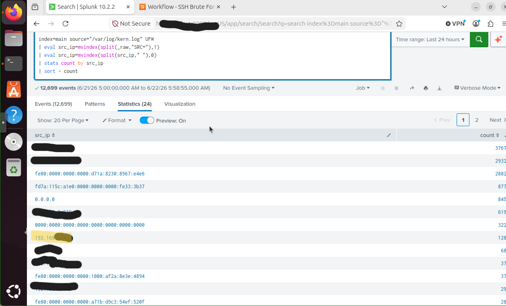
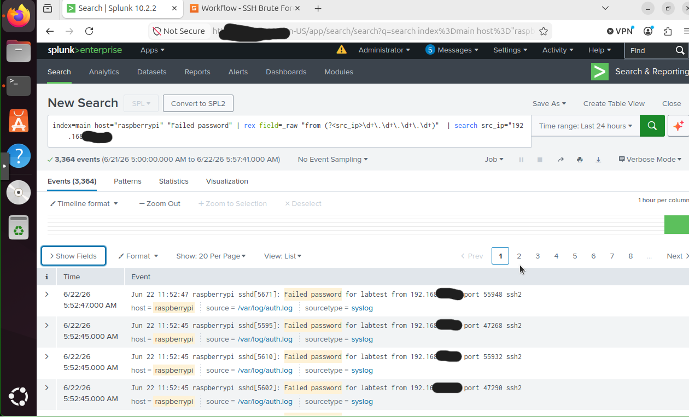
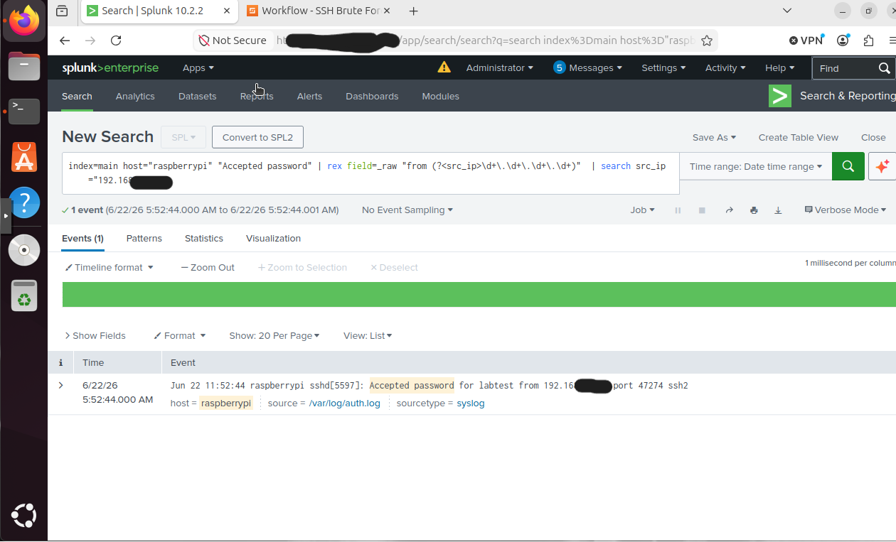
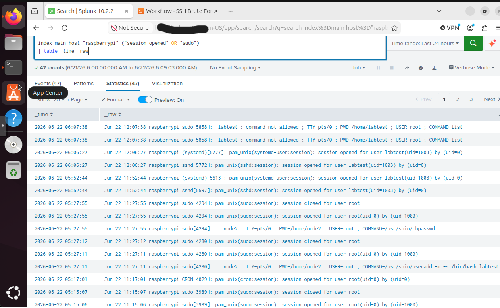
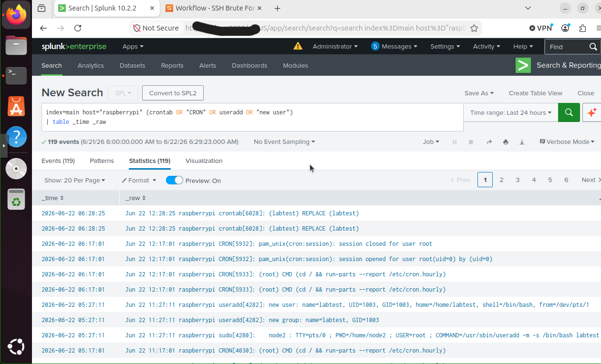
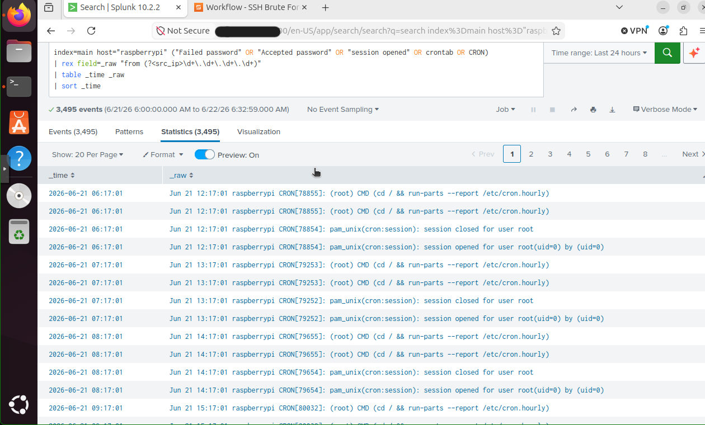
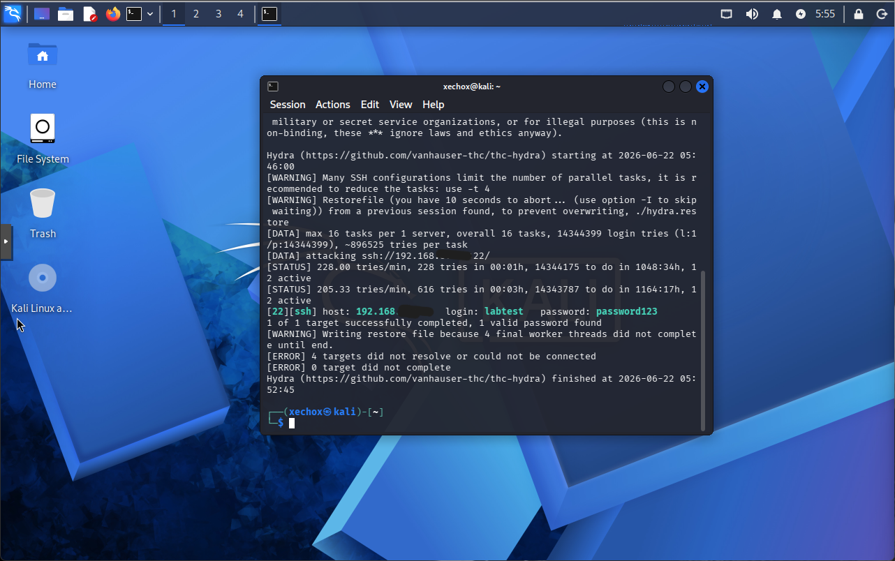

# 🚨 Incident Response: Multi-Stage SSH Intrusion (NIST 800-61)


## Objective
Plan and execute a complete incident response against a multi-stage SSH intrusion, following the NIST SP 800-61 lifecycle end to end. This project demonstrates the full analyst workflow: preparing an IR plan and playbook, detecting a live multi-stage attack in a SIEM, containing and eradicating the threat, recovering the system, and producing a formal after-action report with response metrics and MITRE ATT&CK mapping.

---

## What This Project Demonstrates

Unlike a single-attack demo, this project covers the entire incident response lifecycle the way a real SOC operates — from written preparation through live execution to post-incident review. A realistic intrusion was carried out against a monitored endpoint, detected at every stage, and responded to by following a documented playbook.

---

## The NIST 800-61 Lifecycle Applied

```
Phase 1 — Preparation
   IR Plan + SSH Intrusion Playbook authored in advance

Phase 2 — Detection & Analysis
   All 4 attack stages detected in Splunk; incident timeline reconstructed

Phase 3 — Containment, Eradication & Recovery
   Attacker blocked, persistence removed, account deleted, system hardened

Phase 4 — Post-Incident Activity
   Metrics calculated (MTTD, MTTR, dwell time); after-action report produced
```

---

## The Attack Scenario

A four-stage intrusion was executed from Kali Linux against a monitored Raspberry Pi endpoint:

| Stage | Attacker Action | MITRE ATT&CK |
|-------|----------------|--------------|
| 1. Reconnaissance | Nmap service scan | T1046 Network Service Discovery |
| 2. Credential Access | Hydra SSH brute force | T1110.001 Password Guessing |
| 3. Initial Access & Execution | SSH login + enumeration commands | T1078 Valid Accounts, T1059 |
| 4. Persistence | Cron job for maintained access | T1053.003 Scheduled Task: Cron |

---

## Environment

| Component | Role |
|-----------|------|
| Splunk Enterprise (Ubuntu VM) | SIEM — detection and incident reconstruction |
| Raspberry Pi 5 | Monitored Linux endpoint (victim) |
| Kali Linux (VM) | Attack simulation host |
| Proxmox VE | Hypervisor |
| UFW + Splunk Universal Forwarder | Endpoint logging and forwarding |

---

## Response Metrics

| Metric | Value | Description |
|--------|-------|-------------|
| Time to Compromise | ~18 min | Attack start to successful unauthorized access |
| Mean Time to Detect (MTTD) | ~12 min | Initial access to detection in SIEM |
| Mean Time to Respond (MTTR) | ~2 min | Detection to containment start |
| Total Dwell Time | ~25 min | Initial access to full eradication |

A 2-minute MTTR reflects efficient response execution. The detection latency was identified as the primary improvement opportunity, addressed in the report's recommendations.

---

## Detection Walkthrough

### Stage 1 — Reconnaissance Detected
The Nmap scan generated a spike of UFW firewall block events from a single source IP.


### Stage 2 — Brute Force Detected
Repeated failed SSH authentication events from the attacker IP revealed the brute force in progress.


### Compromise Confirmed
The "Accepted password" event confirmed the attacker successfully gained access — escalating the incident to Critical.


### Stage 3 — Unauthorized Access Detected
Splunk recorded the SSH session opening for the compromised account along with post-access command activity.


### Stage 4 — Persistence Detected
The attacker's cron job persistence mechanism was caught in the logs.


### Full Incident Timeline
A consolidated Splunk search reconstructed the entire attack chain in chronological order.


---

## The Attack (Kali)

The brute force successfully cracked the test account credentials, providing the attacker initial access.


---

## Response Walkthrough

### Containment
The attacker source IP was blocked at the host firewall (UFW) and the active attacker session was terminated. Volatile evidence — active sessions, network connections, and running processes — was preserved before any changes were made.

### Eradication & Recovery
- Removed the cron job persistence
- Deleted the compromised account
- Hardened SSH (disabled root login, reduced MaxAuthTries)
- Deployed fail2ban for automated brute force protection

---

## Project Deliverables

| Document | Description |
|----------|-------------|
| [Incident Response Plan](ir-plan/) | NIST 800-61 IR plan scoped to the lab environment |
| [SSH Intrusion Playbook](playbook/) | Step-by-step response runbook for this attack type |
| [Incident Report IR-2026-004](incident-report/) | Formal after-action report with metrics and analysis |

Each deliverable is provided in both Markdown and Word format.

---

## MITRE ATT&CK Coverage

| Tactic | Technique | ID |
|--------|-----------|-----|
| Discovery | Network Service Discovery | T1046 |
| Credential Access | Brute Force: Password Guessing | T1110.001 |
| Initial Access | Valid Accounts | T1078 |
| Execution | Command and Scripting Interpreter | T1059 |
| Persistence | Scheduled Task/Job: Cron | T1053.003 |

---

## Key Findings & Recommendations

**Root cause:** A weak password combined with password-based SSH authentication allowed a successful brute force attack.

**Top recommendations:**
- Enforce key-based SSH authentication and disable password auth
- Create a real-time SIEM alert for successful login following failed attempts from the same IP
- Maintain fail2ban across all SSH-exposed endpoints
- Integrate detection with SOAR for automated enrichment and response

---

## Skills Demonstrated

- Incident response planning and playbook development
- NIST SP 800-61 lifecycle execution
- SIEM-based detection and incident reconstruction (Splunk)
- Multi-stage attack analysis and scoping
- Containment, eradication, and recovery execution
- Response metrics calculation (MTTD, MTTR, dwell time)
- MITRE ATT&CK mapping
- Formal incident documentation and reporting

---

## References

- [NIST SP 800-61 Rev. 2](https://csrc.nist.gov/publications/detail/sp/800-61/rev-2/final)
- [MITRE ATT&CK](https://attack.mitre.org)
- [Splunk Documentation](https://docs.splunk.com)
